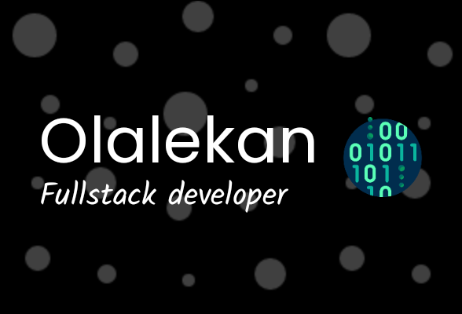

<!--  -->
<!-- 

 -->
<h1 align="center">Hi</h1> 

- I am a Full stack developer
- 👨‍💻 All projects are available at [olalekan-develops.netlify.app](olalekan-develops.netlify.app)

<h3 align="center">Languages and Tools:</h3>

         <a href="https://tailwindcss.com/" target="_blank" rel="noreferrer">  

<!-- 
&nbsp;
 -->

<!---
nebulahh/nebulahh is a ✨ special ✨ repository because its `README.md` (this file) appears on your GitHub profile.
You can click the Preview link to take a look at your changes.
--->
